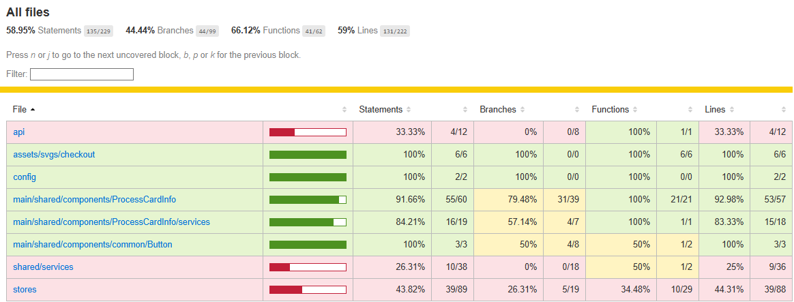

# Prueba Técnica React + Typescript

## Instalación

1. Clona el repositorio:
```bash
git clone https://github.com/Angeldadro/prueba-tecnica-react/tree/main
cd prueba-tecnica-react
```

2. Instala las dependencias:
```bash
npm install
```

## Docker

### Construir la imagen
```bash
docker build -t pt-react .
```

### Ejecutar el contenedor
```bash
docker run -p 8000:8000 pt-react
```

La aplicación estará disponible en `http://localhost:8000`

## Ejecución de Tests

### Ejecutar todos los tests
```bash
npm test
```

### Ejecutar tests en modo watch
```bash
npm run test:watch
```

### Ejecutar tests con cobertura
```bash
npm test -- --coverage
```

### Limpiar caché de Jest
Si encuentras problemas con los tests, puedes limpiar la caché:
```bash
npm test -- --clearCache
```

## Estructura de Tests

Los tests están organizados en la siguiente estructura:
- `src/main/shared/components/`: Tests de componentes
- `src/stores/`: Tests de slices de Redux
- `src/main/shared/services/`: Tests de servicios

## Configuración de Tests

El proyecto utiliza:
- Jest como framework de testing
- React Testing Library para testing de componentes
- ts-jest para soporte de TypeScript
- jsdom como entorno de testing

La configuración de Jest se encuentra en `jest.config.mjs`.

## Reportes de Cobertura

Después de ejecutar los tests con cobertura, se generará un reporte en la carpeta `coverage/`. Puedes abrir `coverage/lcov-report/index.html` en tu navegador para ver el reporte detallado.

El reporte incluye:
- Porcentaje de cobertura por archivo
- Líneas cubiertas/no cubiertas
- Funciones cubiertas/no cubiertas
- Ramas cubiertas/no cubiertas

## Solución de Problemas

### Errores comunes y soluciones:

1. **Error de caché de Jest**
```bash
npm test -- --clearCache
```

2. **Problemas con dependencias**
```bash
rm -rf node_modules package-lock.json
npm install
```

3. **Errores de TypeScript en tests**
```bash
npm run lint
```

## Scripts Disponibles

- `npm test`: Ejecuta todos los tests
- `npm run test:watch`: Ejecuta tests en modo watch
- `npm run lint`: Ejecuta el linter
- `npm run build`: Compila el proyecto
- `npm run dev`: Inicia el servidor de desarrollo


